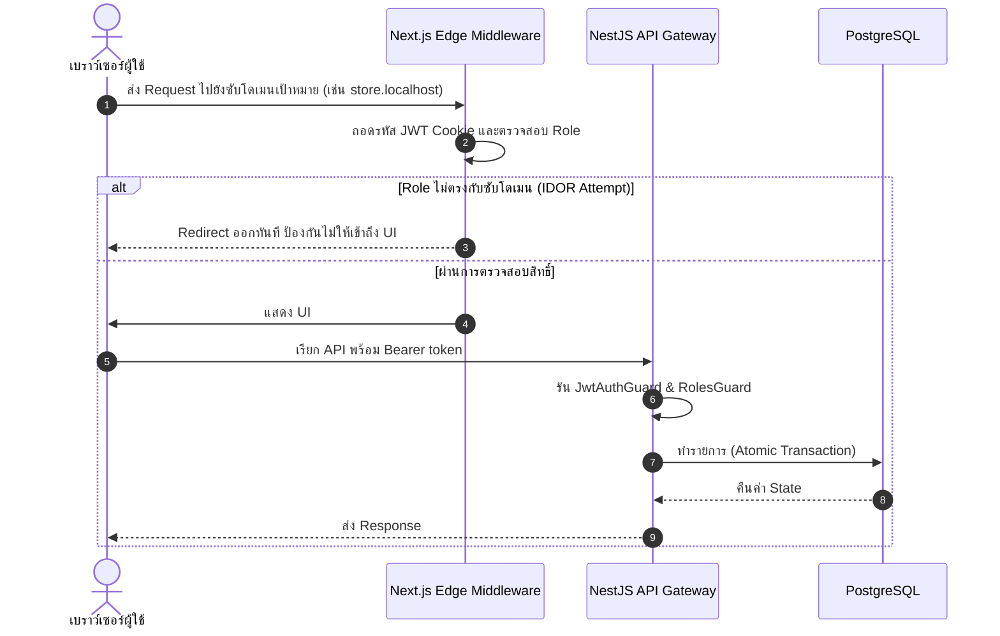

# แพลตฟอร์มบริหารจัดการโลจิสติกส์แบบหลายพอร์ทัลที่มีระบบติดตามแบบเรียลไทม์สำหรับธุรกิจขนาดกลางและขนาดย่อม (SwiftPath)
### Real-time Delivery Tracking and Catalog Management System for In-house SME Logistics (SwiftPath)

> **โครงงานวิทยาการคอมพิวเตอร์ / เทคโนโลยีสารสนเทศ** — แพลตฟอร์มบริหารจัดการงานจัดส่งสินค้าสำหรับร้านค้าขนาดกลางถึงเล็กที่มี "พนักงานขับรถเป็นของตัวเอง" (เช่น ร้านวัสดุก่อสร้าง, ร้านขายส่งของสด) บนสถาปัตยกรรม Multi-tenant แบบแยกซับโดเมนและระบบตรวจสอบความปลอดภัยที่ขอบเขตของเครือข่าย (Edge Security)

---

## 1. บทสรุปผู้บริหารและขอบเขตของธุรกิจ

**ปัญหา (The Problem):** ร้านค้า SME หลายแห่ง (เช่น ร้านวัสดุก่อสร้าง, ร้านเฟอร์นิเจอร์, ร้านส่งวัตถุดิบขนาดใหญ่) มีรถกระบะและพนักงานส่งของเป็นของตัวเอง แต่ยังคงจัดการออเดอร์ด้วย "กระดาษบิล" และ "โทรศัพท์ตามตัวคนขับ" ทำให้ลูกค้าไม่สามารถติดตามสถานะสินค้าได้ และร้านค้าไม่มีข้อมูลเชิงสถิติเพื่อบริหารยอดขาย

**ทางออก (The Solution - SwiftPath):** แพลตฟอร์ม B2B SaaS ที่ช่วยให้ร้านค้าสามารถเปลี่ยนผ่านสู่ระบบดิจิทัลได้อย่างสมบูรณ์แบบ โดยมีจุดเด่นที่แตกต่างจากแอป Food Delivery ทั่วไปคือ:
1. **In-house Fleet Management:** คนขับเป็นพนักงานของร้านค้าเอง ร้านค้าสามารถ "มอบหมายงาน (Assign)" ให้คนขับแบบเจาะจงได้โดยตรง ไม่ใช่ระบบไรเดอร์อิสระ (Freelance Radar)
2. **Multi-item Catalog:** ร้านค้าสามารถสร้างฐานข้อมูลสินค้า (Catalog) และเปิดบิล 1 ใบที่มีสินค้าหลายรายการได้
3. **Public Tracking:** ลูกค้าของร้าน (Customer) ไม่จำเป็นต้องสมัครสมาชิกในระบบ ก็สามารถเช็คสถานะรถส่งของและเวลาถึงโดยประมาณ (ETA) ได้ผ่านลิงก์ Tracking ทันที

---

## 2. สถาปัตยกรรมระบบและโครงสร้างพอร์ทัล

ระบบประกอบด้วยสามชั้นหลัก คือ Edge Security Gateway (Next.js Middleware), ชั้น Application API (NestJS), และชั้น Persistence (PostgreSQL ผ่าน Prisma ORM)

### 2.1 ทะเบียนพอร์ทัลซับโดเมน (Multi-Portal)

ระบบบังคับใช้ขอบเขตการเข้าถึงข้อมูลอย่างเคร่งครัดระหว่างผู้ใช้ 4 บทบาท แต่ละกลุ่มถูกจำกัดไว้ในซับโดเมนของตัวเอง:

| พอร์ทัล | URL สำหรับพัฒนา | บทบาทที่อนุญาต | หน้าที่หลักในระบบ SME Logistics |
| :--- | :--- | :--- | :--- |
| **Admin** | `http://localhost:3000/admin` | Admin | Dashboard จัดการร้านค้าทั้งหมด (Super Admin) |
| **Merchant** | `http://store.localhost:3000` | Merchant | (เจ้าของร้าน) จัดการ Catalog, สร้างบิลออเดอร์, มอบหมายงานให้คนขับ, ดูสถิติยอดขาย |
| **Driver** | `http://fleet.localhost:3000` | Driver | (พนักงานขับรถ) ดูงานที่ได้รับมอบหมาย, อัปเดตสถานะการส่ง, ถ่ายรูปหลักฐานการส่ง (Proof of Delivery) |
| **Customer** | `http://app.localhost:3000` | Customer | (ลูกค้าของร้าน) ดูประวัติการสั่งซื้อ และติดตามตำแหน่งพัสดุแบบ Real-time |

### 2.2 ขั้นตอนการตรวจสอบสิทธิ์และการรักษาความปลอดภัย (Edge Security)



---

## 3. Technology Stack ระดับ Production

**ชั้น Frontend (UI & Gateway)**
- **Framework:** Next.js (App Router) จัดการ Routing แยกตามซับโดเมน
- **Language:** TypeScript 
- **Styling:** Tailwind CSS + Vanilla CSS Token System (Glassmorphism, Modern UI)
- **Real-time:** Socket.io-client สำหรับอัปเดต GPS คนขับบนแผนที่สดๆ
- **Visualization:** Recharts สำหรับ Dashboard สถิติร้านค้า

**ชั้น Backend (API & Business Logic)**
- **Framework:** NestJS (Node.js) สถาปัตยกรรม Module-based
- **Database:** PostgreSQL บริหารด้วย Prisma ORM
- **Security:** Passport.js (JWT), OTP Authentication, NestJS Throttler ป้องกัน Brute-force
- **Real-Time:** Socket.io Gateway สำหรับ Tracking
- **Storage:** Firebase Storage สำหรับอัปโหลดรูปหลักฐานการส่งมอบ (Proof of Delivery)

---

## 4. ไฮไลท์ฟีเจอร์ทางเทคนิคเชิงลึก (Technical Highlights)

### 4.1 ระบบจัดการสถานะออเดอร์และมอบหมายงาน (Order State Machine)
- ฐานข้อมูลถูกออกแบบให้รองรับ `OrderItem` เพื่อจัดการบิลแบบหลายรายการ (Multi-item)
- State Machine ขับเคลื่อนจาก: `PENDING` (สร้างบิล) -> `ACCEPTED` (ร้านมอบหมายงานให้คนขับ) -> `PICKED_UP` (ของขึ้นรถ) -> `SHIPPING` (กำลังไปส่ง) -> `DELIVERED`
- การตรวจสอบสิทธิ์ระดับ Resource: `OrdersService` จะตรวจสอบเสมอว่า `merchantId` หรือ `driverId` ตรงกับผู้ร้องขอหรือไม่ ป้องกันร้านค้าอื่นแอบดูข้อมูล

### 4.2 ระบบ Smart Soft Delete สำหรับ Catalog สินค้า
เพื่อป้องกันข้อผิดพลาดทางบัญชี หากร้านค้ากดลบสินค้าที่ "เคยขายและมีประวัติอยู่ในบิลเก่า" ระบบจะสลับไปใช้ **Soft Delete** (`isActive: false`) แทนการลบทิ้งถาวร เพื่อรักษายอดขายในหน้ารายงาน (Analytics Dashboard) ให้คงเดิม แต่ซ่อนสินค้าออกจากหน้าสร้างออเดอร์ใหม่

### 4.3 Real-time Public Tracking พร้อมการป้องกัน Rate Limit
ลูกค้าสามารถติดตามสถานะด้วย Tracking Number (เช่น `SP1A2B3C4D5E`) ระบบถูกป้องกันด้วย `@Throttle({ default: { limit: 10, ttl: 60000 } })` ป้องกันการยิงเดาสุ่มหมายเลข (Brute-force Enumeration) นอกจากนี้ยังมีการทำ Fuzzy Lat/Lng ลดความแม่นยำของพิกัดเพื่อความเป็นส่วนตัว

### 4.4 Optimistic Concurrency Control (OCC)
สำหรับป้องกัน Race Condition ในการอัปเดตข้อมูลทางการเงินของร้านค้า ใช้กลไกฟิลด์ `version` ใน Prisma เพื่อทำ Atomic Update ยืนยันว่า Data Consistency จะไม่พังเมื่อมีการ Request เข้ามาพร้อมกัน (เช่น การคำนวณยอดขายสรุปสิ้นวัน)

---

## 5. การติดตั้งสำหรับการพัฒนาในเครื่อง

### สิ่งที่ต้องเตรียม
- Node.js v20+
- Docker Desktop (สำหรับรัน PostgreSQL)
- อัปเดตไฟล์ hosts ของระบบ OS (เพื่อให้รองรับซับโดเมน)
  - Windows: `C:\Windows\System32\drivers\etc\hosts`
  - Mac/Linux: `/etc/hosts`
  ```text
  127.0.0.1  app.localhost
  127.0.0.1  store.localhost
  127.0.0.1  fleet.localhost
  ```

### การเริ่มต้น Backend
```bash
cd backend
npm install
# สร้างไฟล์ .env โดยมี: DATABASE_URL, JWT_SECRET
npx prisma generate
npx prisma db push
npm run start:dev
```

### การเริ่มต้น Frontend
```bash
cd frontend
npm install
# สร้างไฟล์ .env.local โดยมี: NEXT_PUBLIC_API_URL, NEXT_PUBLIC_BASE_DOMAIN
npm run dev
```

### ฐานข้อมูล (Infrastructure)
```bash
docker compose up -d
```

---

*พัฒนาขึ้นเพื่อแก้ไขปัญหาคอขวดของธุรกิจ SME ไทย เปลี่ยนระบบกระดาษสู่ระบบดิจิทัลด้วยมาตรฐานทางวิศวกรรมซอฟต์แวร์ที่แข็งแกร่ง*