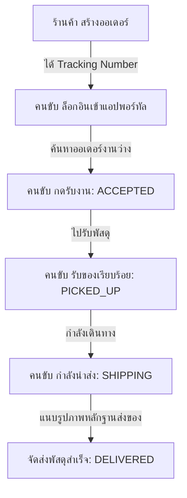

# คู่มือการทดสอบระบบ SwiftPath (Testing Guide)
คู่มือฉบับนี้จัดทำขึ้นเพื่อใช้เป็นแนวทางสำหรับการเตรียมสภาพแวดล้อม การรันระบบ และขั้นตอนการทดสอบระบบขนส่งและจัดการแค็ตตาล็อกสินค้าแบบเรียลไทม์ (SwiftPath) บนเครื่องคอมพิวเตอร์ของคุณ (Local Environment)

---

## 1. สิ่งที่ต้องติดตั้งในเครื่อง (System Requirements)
* **Node.js** (เวอร์ชันแนะนำ: v18 หรือสูงกว่า)
* **Docker Desktop** (สำหรับจำลองฐานข้อมูล PostgreSQL)
* **Git** (สำหรับจัดการเวอร์ชัน)

---

## 2. การเตรียมสภาพแวดล้อม (Environment Setup)

### ขั้นตอนที่ 2.1: ตรวจสอบและรัน Database ด้วย Docker
1. เปิดโปรแกรม **Docker Desktop**
2. ไปที่โฟลเดอร์โครงการหลัก (`d:\Project`) แล้วสั่งเปิด Container:
   ```bash
   docker compose up -d
   ```
3. ตรวจสอบสถานะการทำงานของตู้คอนเทนเนอร์ (ต้องแสดงสถานะ **Up** บนพอร์ต `5432`):
   ```bash
   docker ps
   ```

### ขั้นตอนที่ 2.2: กำหนดค่าไฟล์ตัวแปรระบบ (`.env`)
ตรวจสอบให้แน่ใจว่าในโฟลเดอร์ `backend/.env` มีตัวแปรเชื่อมฐานข้อมูลดังนี้:
```env
# Database Connection URL
DATABASE_URL="postgresql://<DB_USER>:<DB_PASSWORD>@localhost:5432/<DB_NAME>?schema=public"

# ส่วนการตั้งค่าอื่น ๆ (Stripe, Firebase)
JWT_SECRET=<YOUR_JWT_SECRET>
ADMIN_SEED_EMAIL=admin@swiftpath.com
ADMIN_SEED_PASSWORD=<ADMIN_SEED_PASSWORD>
```

---

## 3. การตั้งค่าสิทธิ์เข้าถึง Subdomains (Local Hosts)
เนื่องจาก SwiftPath ทำงานโดยแบ่งพอร์ทัลผู้ใช้ออกตามซับโดเมน คุณจำเป็นต้องเพิ่มโดเมนจำลองลงไปในระบบปฏิบัติการ เพื่อให้เบราว์เซอร์รู้จักชื่อโดเมนเหล่านี้

### สำหรับระบบ Windows
1. ค้นหาโปรแกรม **Notepad** จากช่องค้นหา
2. คลิกขวาแล้วเลือก **"Run as Administrator"** (เปิดในฐานะผู้ดูแลระบบ)
3. กด Open แล้วเลือกไฟล์ไปที่: `C:\Windows\System32\drivers\etc\hosts` (หากไม่เห็นไฟล์ ให้เปลี่ยนฟิลเตอร์มุมล่างขวาจาก `Text Documents (*.txt)` เป็น `All Files (*.*)`)
4. เพิ่มบรรทัดต่อไปนี้ลงไปด้านล่างสุดของไฟล์ แล้วทำการกดบันทึก (Save):
   ```text
   127.0.0.1 admin.localhost
   127.0.0.1 store.localhost
   127.0.0.1 fleet.localhost
   ```

---

## 4. วิธีเริ่มรันเซิร์ฟเวอร์ระบบ (Running Servers)

รันคำสั่งเหล่านี้แยกคนละหน้าต่าง Terminal (หรือ PowerShell):

### หน้าต่างที่ 1: ฝั่งเซิร์ฟเวอร์เบื้องหลัง (NestJS Backend)
```bash
cd backend
npm install
npx prisma db push   # เพื่อเตรียมโครงสร้างตารางของ Database
npm run start:dev
```
*ระบบจะเปิดทำงานที่: http://localhost:8000*

### หน้าต่างที่ 2: ฝั่งหน้าบ้าน (Next.js Frontend)
```bash
cd frontend
npm install
npm run dev
```
*ระบบจะเปิดทำงานที่: http://localhost:3000*

---

## 5. บัญชีเข้าทดสอบระบบจำลอง (Test Accounts)

| พอร์ทัลระบบ (Portal) | ลิงก์ทดสอบบนเบราว์เซอร์ | อีเมลผู้ใช้ | รหัสผ่าน |
| :--- | :--- | :--- | :--- |
| **Admin Portal** | [admin.localhost:3000](http://admin.localhost:3000) | `admin@swiftpath.com` | `<ADMIN_SEED_PASSWORD>` |
| **Merchant Portal** | [store.localhost:3000](http://store.localhost:3000) | `merchant@test.com` | `Test@1234` |
| **Driver Portal** | [fleet.localhost:3000](http://fleet.localhost:3000) | `driver@test.com` | `Test@1234` |
| **Customer Web** | [localhost:3000](http://localhost:3000) | *ไม่ต้องล็อกอิน* | ใช้ค้นหาผ่านเบอร์โทรศัพท์ หรือ เลขพัสดุ (เช่น `SP26CC206CEE`) |

---

## 6. วงจรการทดสอบแบบสิ้นสุด (End-to-End Test Workflow)

เพื่อจำลองการส่งพัสดุจริง ให้ทำตามลำดับขั้นตอนดังนี้:



1. **ขั้นตอนการสร้างงาน (Merchant):**
   * ล็อกอินเข้าสู่หน้าพอร์ทัลร้านค้า (`store.localhost:3000`)
   * ไปที่เมนู **"สร้างออเดอร์"**
   * กรอกรายละเอียดผู้รับ ที่อยู่ และราคาสินค้า จากนั้นกดบันทึก
   * คัดลอกเลข **Tracking Number** (เช่น `SPxxxxxxxxxx`) เอาไว้
2. **ขั้นตอนการทำงานของขนส่ง (Driver):**
   * ล็อกอินเข้าสู่หน้าพอร์ทัลคนขับ (`fleet.localhost:3000`)
   * ไปที่หน้า **"รับงาน"** (Available Jobs) จะเจองานของร้านค้าแสดงอยู่
   * กด **"รับงาน"** สถานะพัสดุจะอัปเดตเป็น `ACCEPTED`
   * เมื่อไปถึงร้านค้ารับพัสดุแล้ว ให้กดอัปเดตสถานะเป็น **"รับพัสดุแล้ว"** (`PICKED_UP`)
   * เมื่อออกเดินทางไปส่งพัสดุ ให้กดอัปเดตเป็น **"กำลังเดินทางจัดส่ง"** (`SHIPPING`)
   * เมื่อส่งพัสดุถึงมือผู้รับ ให้แนบลิงก์รูปหลักฐานการเซ็นรับของแล้วกด **"จัดส่งสำเร็จ"** (`DELIVERED`)
3. **การติดตามสถานะ (Customer):**
   * ไปที่หน้าแรก [localhost:3000](http://localhost:3000)
   * กรอกรหัสติดตามพัสดุ (Tracking Number) ที่จดไว้ในขั้นตอนแรก
   * ระบบจะแสดงประวัติความเคลื่อนไหว (Tracking Logs) พร้อมพิกัดแผนที่แบบเรียลไทม์

---

## 7. วิธีแก้ไขปัญหาเบื้องต้น (Troubleshooting)
* **หากรัน backend แล้วขึ้น `Can't reach database server`:**
  * เช็กให้แน่ใจว่า Docker Desktop กำลังเปิดทำงานอยู่และ Container รันแล้ว
  * ทดลองรันคำสั่ง `docker start logistics_db` เพื่อดึงเซิร์ฟเวอร์ขึ้นมาใหม่
* **หากเรียกเว็บในพอร์ทัลย่อยแล้วขึ้น `Site can't be reached`:**
  * ตรวจสอบว่าคุณได้เข้าไปเพิ่มชื่อซับโดเมนจำลองในไฟล์ `hosts` หรือยัง และบันทึกไฟล์นั้นเป็น Admin หรือไม่
* **หากสร้างออเดอร์และขึ้นหน้าสีส้ม/แดงเตือนภัยสภาพอากาศ:**
  * ฟีเจอร์ weather-pricing กำลังจำลองราคาชาร์จเพิ่มเมื่อฝนตก ซึ่งเป็นส่วนหนึ่งของการประเมินราคาตามจริง (Surge Pricing) สามารถกรอกเมืองจัดส่งเป็นภาษาอังกฤษเช่น `Bangkok` หรือ `Nonthaburi` เพื่อให้ระบบเรียกดึงข้อมูลพยากรณ์อากาศมาใช้งานได้จริง
