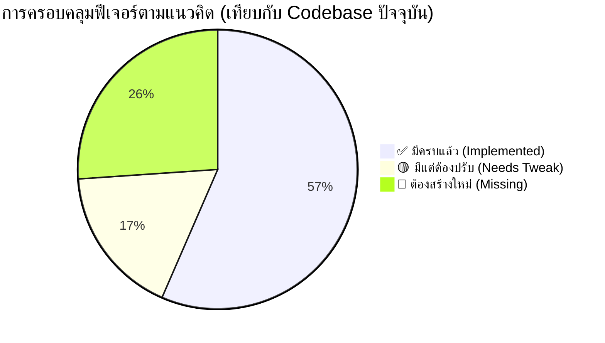

# เอกสารเปรียบเทียบแนวคิดระบบ vs. โปรเจกต์ SwiftPath

> **วัตถุประสงค์:** วิเคราะห์ว่าแนวคิด "ระบบจัดการโลจิสติกส์สำหรับร้านค้าขนาดกลาง-เล็ก" สอดคล้องกับสิ่งที่ Implement ไว้แล้วในโค้ดแค่ไหน และประเมินความเหมาะสมในฐานะโปรเจกต์จบการศึกษา

---

## ส่วนที่ 1: ภาพรวมแนวคิดธุรกิจ

แนวคิดของระบบ คือ **ระบบตัวกลางบริหารจัดการงานส่งของ** สำหรับร้านค้าขนาดกลางถึงเล็กที่รับออเดอร์จากลูกค้าผ่านช่องทางออฟไลน์อยู่แล้ว (โทรศัพท์ / LINE / หน้าร้าน) และมีพนักงานส่งของเป็นของตัวเอง กลุ่มเป้าหมายหลัก ได้แก่:

- 🏗️ ร้านวัสดุก่อสร้าง
- 🐟 ร้านขายของสด / ของทะเล
- 🛒 ร้านขายวัตถุดิบที่ลูกค้าต้องรอรับที่บ้าน (สินค้าขนาดใหญ่)

### บทบาทในระบบ (Actors)
| บทบาท | หน้าที่หลักตามแนวคิด |
| :--- | :--- |
| **ร้านค้า (Merchant)** | คีย์ข้อมูลออเดอร์ที่ได้รับจากลูกค้านอกระบบ, จัดส่ง, ดูรายงาน |
| **คนขับ (Driver)** | พนักงานของร้านเอง รับมอบหมายงาน, อัปเดตสถานะ, ถ่ายรูปหลักฐาน |
| **ลูกค้า (Customer)** | เช็คสถานะการจัดส่ง, ดูบิลรายละเอียด, ดูประวัติสั่งซื้อ |

---

## ส่วนที่ 2: เปรียบเทียบรายฟีเจอร์

### 🟢 สิ่งที่มีในโค้ดแล้ว — สอดคล้องกับแนวคิด

| ฟีเจอร์ที่แนวคิดต้องการ | สิ่งที่มีอยู่ในโค้ด | ระดับความสอดคล้อง |
| :--- | :--- | :---: |
| ร้านค้าเป็นคนคีย์ออเดอร์เข้าระบบ | `POST /orders` จำกัดเฉพาะ Role Merchant ใน [orders.controller.ts](file:///d:/Project/backend/src/orders/orders.controller.ts#L15-L20) | ✅ สมบูรณ์ |
| ลูกค้าไม่ต้องมีบัญชีในระบบ | `customerId` เป็น `Int?` (Optional) ใน [schema.prisma](file:///d:/Project/backend/prisma/schema.prisma#L135) | ✅ สมบูรณ์ |
| ลูกค้าเช็คสถานะการส่งของ | Public Tracking Endpoint `GET /orders/track/:id` พร้อม Rate Limit ป้องกัน Brute-force | ✅ สมบูรณ์ |
| อัปเดตสถานะออเดอร์แบบ Real-time | WebSocket (Socket.io) ส่ง Event ทุก State Transition ใน [orders.service.ts](file:///d:/Project/backend/src/orders/orders.service.ts#L470-L474) | ✅ สมบูรณ์ |
| Tracking Log / ประวัติการส่ง | ตาราง `TrackingLog` ใน [schema.prisma](file:///d:/Project/backend/prisma/schema.prisma#L152-L166) บันทึกทุก Status Change | ✅ สมบูรณ์ |
| คนขับถ่ายรูปหลักฐานการส่งมอบ | `proofOfDelivery` field + upload ไป Firebase Storage ใน [orders.service.ts](file:///d:/Project/backend/src/orders/orders.service.ts#L525-L550) | ✅ สมบูรณ์ |
| ระบบคำนวณเวลาจัดส่งโดยประมาณ (ETA) | คำนวณจาก Haversine Formula (ระยะทาง GPS) + ปรับค่าตามสภาพอากาศ | ✅ สมบูรณ์ |
| ร้านค้าดูรายงาน/สถิติการส่งของ | `GET /orders/analytics` และ `GET /orders/stats` — ดู Revenue, Success Rate, Status Distribution | ✅ สมบูรณ์ |
| ระบบ State Machine ของออเดอร์ | `PENDING → ACCEPTED → PICKED_UP → SHIPPING → DELIVERED / CANCELLED` ครบทุกสถานะ | ✅ สมบูรณ์ |
| Multi-Portal แยกตามบทบาท | 4 ซับโดเมน: Customer, Merchant, Driver, Admin พร้อม Edge Middleware ป้องกัน IDOR | ✅ สมบูรณ์ |
| ระบบแชทสื่อสารภายในออเดอร์ | Chat Module ผ่าน Socket.io ในฐาน `Message` model | ✅ สมบูรณ์ |
| Push Notification แจ้งเตือนสถานะ | Firebase Cloud Messaging (FCM) ใน notifications module | ✅ สมบูรณ์ |
| ระบบ Login หลายช่องทาง | Google, Facebook, LINE OAuth + Firebase Phone OTP ใน auth module | ✅ สมบูรณ์ |

---

### 🟡 สิ่งที่มีแต่ไม่ตรงแนวคิด 100% — ต้องปรับแต่ง

| สิ่งที่มีในโค้ด | แนวคิดที่แตกต่าง | สิ่งที่ควรปรับ |
| :--- | :--- | :--- |
| **Driver รับงานเองจาก Radar Map** — โมเดล Freelance ไรเดอร์ | แนวคิด: คนขับเป็น "พนักงานประจำร้าน" ไม่ใช่ไรเดอร์อิสระ | เพิ่ม endpoint ให้ **Merchant มอบหมายงาน (Assign)** ให้คนขับเฉพาะของร้านตัวเองได้ |
| **Wallet/กระเป๋าเงินคนขับ** — ระบบสะสมรายได้ต่อ Trip | แนวคิด: คนขับได้รับเงินเดือนจากร้าน ไม่ต้องรับค่าส่งรายครั้ง | ระบบ Wallet ยังใช้ได้ แต่ควรมี Mode ปิด/เปิดตามประเภทการจ้างงาน |
| **Surge Pricing ตามสภาพอากาศ** — ปรับราคาส่ง +20% ถ้าฝนตก | แนวคิด: ร้านค้าเป็นคนจัดส่งเอง อาจไม่จำเป็นต้องชาร์จ Surge ลูกค้า | ควรทำเป็น Optional Toggle สำหรับร้านที่ต้องการใช้ |
| **คนขับจ่ายเงินผ่าน Wallet ของตัวเอง** (`PATCH /pay`) | แนวคิด: ไม่มีการโอนเงินระหว่างไรเดอร์กับระบบ | ปรับให้ Flow การเงินเป็นแบบ "บันทึกรายการ" แทนการหักเงินจริง |

---

### 🔴 สิ่งที่ขาด — แนวคิดต้องการแต่ไม่มีในโค้ด

| ฟีเจอร์ที่แนวคิดต้องการ | ปัจจุบันเป็นอย่างไร | สิ่งที่ต้องสร้างใหม่ |
| :--- | :--- | :--- |
| **บิลหลายรายการสินค้าในออเดอร์เดียว** (Multi-item Invoice) | `Order` เก็บ `productName` + `quantity` แบบ 1 รายการต่อ 1 ออเดอร์ | ต้องสร้างตาราง `OrderItem` แบบ One-to-Many พร้อม UI สำหรับเพิ่มหลายรายการ |
| **ความสัมพันธ์ Driver-Merchant** (คนขับสังกัดร้าน) | Driver เป็น Global Entity ไม่มีความสัมพันธ์กับร้านใดร้านหนึ่ง | เพิ่ม field `merchantId?` ใน `Driver` model หรือสร้าง Junction Table |
| **ระบบ Assign คนขับ** โดย Merchant | Merchant ไม่มีสิทธิ์มอบหมายงานให้ Driver — Driver กดรับเองเท่านั้น | สร้าง Endpoint `PATCH /orders/:id/assign` สำหรับ Merchant ระบุ driverId |
| **ประวัติการสั่งซื้อฝั่งลูกค้า** (ลูกค้าที่ไม่มีบัญชี) | Public Tracking ดูได้แค่ Order เดียวต่อครั้งด้วย Tracking Number | ควรเพิ่มระบบ "เชื่อมประวัติด้วยเบอร์โทรศัพท์" เพื่อรวม Order หลายรายการ |
| **Export รายงาน** (PDF / CSV) | มีข้อมูล Analytics API แต่ไม่มีฟีเจอร์ Export | เพิ่มฟีเจอร์ Export รายงานประจำวัน/เดือน สำหรับ Merchant |
| **ระบบสินค้าคงคลัง / Catalog** | ไม่มีตาราง Product — Merchant ต้องพิมพ์ชื่อสินค้าใหม่ทุกออเดอร์ | Optional: สร้าง `Product` model เพื่อให้เลือกสินค้าจาก Catalog แทนพิมพ์ใหม่ |

---

## ส่วนที่ 3: แผนภาพ — สิ่งที่มี vs. สิ่งที่ขาด

---

## ส่วนที่ 4: มุมมองในฐานะโปรเจกต์จบมหาวิทยาลัย

### 📊 การประเมินภาพรวม

> [!IMPORTANT]
> **สรุป: เหมาะสมมากครับ** — แต่ต้องปรับ Scope ให้ชัดเจนก่อนนำเสนอ

### จุดแข็ง (ทำไมมันเหมาะ)

**1. แก้ปัญหาจริงในตลาด (Real Problem)**

ระบบนี้ไม่ใช่แค่ "To-do App" หรือ "E-commerce ทั่วไป" — มันแก้ Pain Point จริงของร้านค้า SME ไทยที่ยังจดออเดอร์ในกระดาษ ซึ่งทำให้โปรเจกต์มีน้ำหนักในเชิง "ความจำเป็นและผลกระทบ" ต่อคณะกรรมการ

**2. Technical Depth ระดับ Production**

- **Authentication:** OAuth Social Login + Firebase OTP (ไม่ใช่แค่ username/password)
- **Security:** Optimistic Locking, Idempotency, Edge Gateway Middleware
- **Real-time:** WebSocket พร้อม JWT ป้องกัน
- **Architecture:** Multi-portal Subdomain, Role-based Access Control
- **CI/CD:** มี GitHub Actions workflow ใน `.github/workflows/ci.yml`

สิ่งเหล่านี้คือจุดที่ทำให้โปรเจกต์นี้ **ดูโดดเด่นและเหนือกว่า** โปรเจกต์จบทั่วไปในระดับมหาวิทยาลัยอย่างชัดเจน

**3. Scope ที่เหมาะสำหรับ 1-2 คน**

- **1 คน:** ยังไหว — แต่ต้องลดฟีเจอร์ที่ "ขาด" ออกบางส่วน และเน้นนำเสนอ Core Flow ให้สมบูรณ์แบบ
- **2 คน:** เหมาะมาก — แบ่งหน้าที่ Backend (คนหนึ่ง) + Frontend (อีกคน) ได้ชัดเจน และยังมีเวลาเพิ่มฟีเจอร์ที่ขาดได้อีก

---

### 💡 คำแนะนำเชิงกลยุทธ์สำหรับการนำเสนอโปรเจกต์

**Reframe ให้โฟกัสที่ "B2B Logistics SaaS สำหรับ SME"** แทนที่จะพยายามอธิบายว่ามันคือ "แอปส่งของทั่วไป" เพราะจุดขายจริงๆ คือ:

> _"เราลดต้นทุนการจัดการงานส่งของสำหรับร้านค้าที่ไม่มีระบบ IT จาก 0 เป็น 100 โดยไม่บังคับให้ใช้ไรเดอร์ภายนอก"_

**ปรับ Scope สำหรับโปรเจกต์จบ (Recommended MVP)**

| ระดับความสำคัญ | ฟีเจอร์ | สถานะ |
| :---: | :--- | :--- |
| 🔴 Must Have | Core Order Flow (Create → Assign → Deliver) | ✅ มีแล้ว ต้องปรับ Assign |
| 🔴 Must Have | Multi-item Invoice (บิลหลายรายการ) | 🔴 ต้องสร้าง |
| 🔴 Must Have | Driver-Merchant Relationship | 🔴 ต้องสร้าง |
| 🟡 Should Have | Public Tracking + ประวัติด้วยเบอร์โทร | 🟡 ปรับบางส่วน |
| 🟡 Should Have | Merchant Analytics Dashboard | ✅ มีแล้ว |
| 🟢 Nice to Have | Export PDF/CSV | 🔴 ต้องสร้าง |
| 🟢 Nice to Have | Product Catalog / ระบบสินค้า | 🔴 ต้องสร้าง |
| ⛔ ตัดออก | Stripe Payment / Wallet คนขับ | มีแล้ว แต่ไม่จำเป็นสำหรับแนวคิดนี้ |
| ⛔ ตัดออก | Surge Pricing / Weather API | มีแล้ว แต่ไม่จำเป็นสำหรับแนวคิดนี้ |

---

### ⚠️ ความเสี่ยงที่ต้องระวัง

> [!WARNING]
> **Feature Creep — ระวังอย่าพยายามนำเสนอทุกอย่างที่มีในโค้ด**
> ฟีเจอร์อย่าง Stripe Payment, Surge Pricing, หรือ Freelance Driver Radar Map นั้น "เก่ง" ในเชิงเทคนิค แต่ถ้าบอกว่าโปรเจกต์นี้คือ "ระบบสำหรับร้านค้าขนาดเล็กที่คนขับเป็นพนักงานของร้านเอง" แล้วยังมีระบบกระเป๋าเงิน Freelance Rider อยู่ด้วย คณะกรรมการอาจสับสนเรื่อง Business Model ได้

> [!CAUTION]
> **ความสม่ำเสมอของ Business Logic** — ควรเลือกว่าโมเดลธุรกิจคือ "Driver เป็นพนักงานร้าน" หรือ "Driver เป็น Freelancer" แล้วปรับโค้ดให้สอดคล้องทั้งหมด การมีทั้งสองโมเดลในระบบเดียวกันโดยไม่มี Toggle/Switch ที่ชัดเจน อาจทำให้ Logic ขัดกัน

---

## ส่วนที่ 5: สรุปและแนวทางถัดไป

### สรุปในหนึ่งประโยค

> โปรเจกต์นี้มีโครงสร้างทางเทคนิคที่แข็งแกร่งมากเกินกว่า "โปรเจกต์จบ" ทั่วไป แต่ Business Model ที่คุณเพิ่งคิดขึ้นมา (ร้าน SME + คนขับประจำร้าน) **ยังไม่ได้ถูก Implement ในโค้ดอย่างสมบูรณ์** — ต้องมีการ Refocus และ Build ฟีเจอร์ที่ขาดอีก 2-3 จุดสำคัญ

### 3 สิ่งที่ควรทำต่อทันที

1. **ออกแบบและเพิ่ม `OrderItem` Table** — เพื่อรองรับบิลหลายรายการสินค้า (จุดที่สำคัญที่สุดสำหรับกลุ่มเป้าหมาย)
2. **สร้างความสัมพันธ์ Driver ↔ Merchant** — เพื่อให้ Merchant Assign งานให้คนขับของตัวเองได้
3. **ปรับ UI ฝั่ง Merchant ให้รองรับ Flow ใหม่** — หน้าสร้างออเดอร์ต้องรองรับการเลือกคนขับจากรายชื่อของร้านได้

---

*วิเคราะห์โดย Antigravity — อ้างอิงจากโครงสร้างโค้ดใน [d:/Project](file:///d:/Project)*
